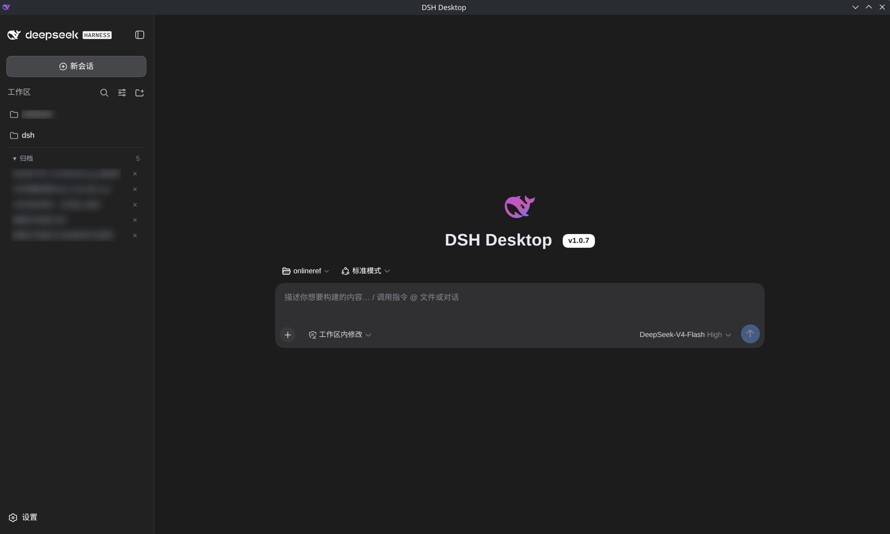

# DSH Desktop

DSH Desktop 是 [DeepSeek Harness](https://github.com/deepseek-ai/deepseek-harness) 的 Debian 桌面客户端。应用内置 dsh 引擎，启动后直接加载官方 Web UI；Electron 负责本地运行时、凭证保护、托盘、自动更新和桌面扩展。

> 非 DeepSeek 官方产品，与 DeepSeek 无附属关系。



## 功能

- 内置 dsh 引擎，首次初始化后可直接使用
- 官方 Web UI，支持流式回复、思考过程、工作区、模型和会话管理
- 本地桌面能力：首启向导、任务与记忆管理、提醒、外观设置和归档会话查看
- 凭证通过 Electron `safeStorage` 加密保存；启用 CSP、导航限制和单实例锁
- 托盘常驻、后台更新检查和下载后安装
- 仅发布 Debian 13 / amd64 `.deb` 安装包

## 安装

从项目的 GitHub Releases 下载 `dsh-desktop_<version>_amd64.deb`，然后执行：

```bash
sudo apt install ./dsh-desktop_<version>_amd64.deb
```

首次启动会初始化 dsh Web profile，时间取决于本机网络与依赖缓存。随后在首启向导或设置中配置模型凭证。

## 开发

要求：Node.js `>=22.19.0`、pnpm `>=9`。项目使用 pnpm 11；推荐通过 Corepack 管理。

```bash
corepack enable
pnpm install
pnpm dev
```

常用命令：

```bash
pnpm typecheck       # 检查 renderer 与 Electron 两个 TypeScript 项目
pnpm test            # 运行 Vitest
pnpm build           # 构建 renderer 与 Electron 主进程
pnpm dist            # 构建 Debian amd64 .deb 到 out/
```

`pnpm dev` 会启动 Vite（5173）与 Electron。正式应用界面由本地 dsh Web 服务提供；Vite 页面用于启动、首启向导和引擎故障回退。

## 架构

```
React fallback UI (src/) -> preload -> IPC -> Electron main -> adapter -> dsh web engine
```

- `adapter/`：dsh JSON-RPC / WebSocket 协议适配与事件归一化
- `shared/`：renderer 与主进程共享的稳定类型和 IPC 契约
- `electron/`：引擎生命周期、IPC、凭证、profile、托盘、更新和桌面桥接
- `plugins/harness-memory/`：随 profile 安装的本地记忆插件

历史交付记录保存在 [docs/history/](docs/history/)。

## License

[MIT](LICENSE)
